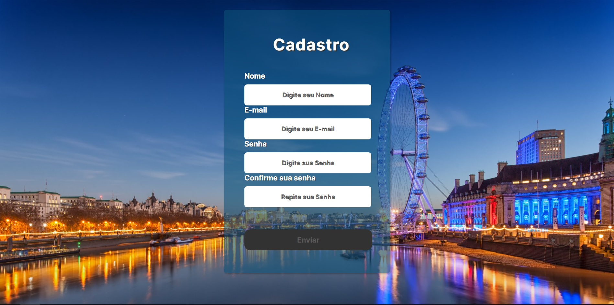

### </>
<h1 align="center" >Tela Cadastro</h1>
<h1 align="center"> 
    
</h1>    

### <🚀 Criador-do-Projeto  🚀> 

🐱‍🏍🐱‍👤 Anderson Paulino. 🐱‍👤🐱‍🏍

### 🛠 Tecnologias utilizadas na criação do projeto.
- [JavaScript](https://www.javascript.com/)
- [HTML5](https://www.w3schools.com/html/default.asp)
- [CSS3](https://www.w3schools.com/css/default.asp)

### Descrição do Projeto

tela de cadastro com verificações nos campos de entrada de dados.

### Verificações ✔

Mensagem de erro e cor dos campos em vermelho, caso exista pendência ou se algum campo for
preenchido incorretamente.

Se o campos forem preenchidos corretamente, a cor dos caracteres de do campo ficará verde.

- Nome:                                         O campo nome deverá conter entre 03 e 25 caracteres.
- E-mail:                Verificação de E-mail por caracteres, não verifica se o E-mail é existente.
- Senha:                                                           Mínimo e máximo de 08 caracteres.
- Confirmar Senha: Mínimo e máximo de 08 caracteres, e os dados devem ser iguais aos do campo Senha.
- Enviar:            Botão estará desativado até que todos os campos serem preenchidos corretamente.

### Ajustes e melhorias

O projeto ainda está em desenvolvimento, e necessita de alguns ajustes.

Próximas melhorias 🔝

1. Cadastro do Nome de usuário será unico.
2. Cadastro de E-mail de usuário será unico.

[⬆ Voltar ao topo](#</>) 